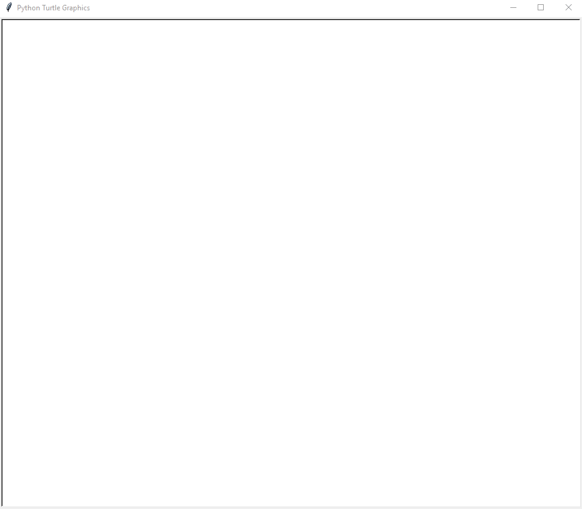
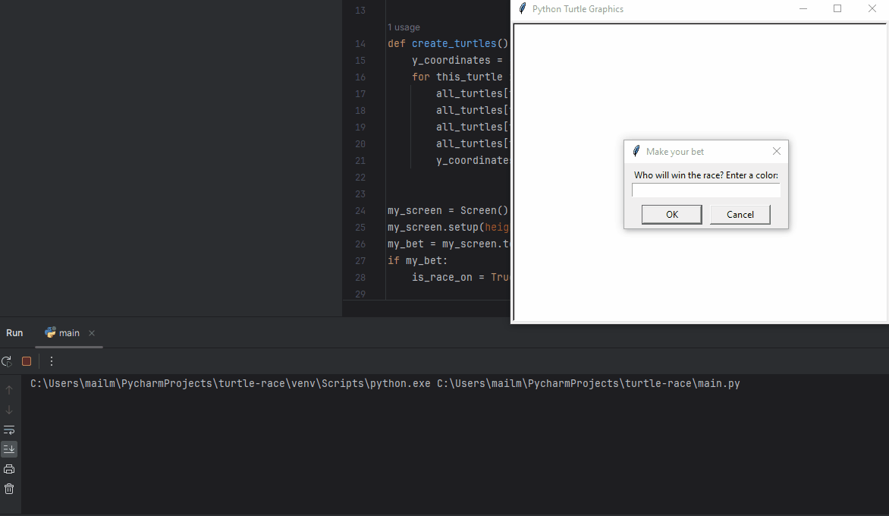
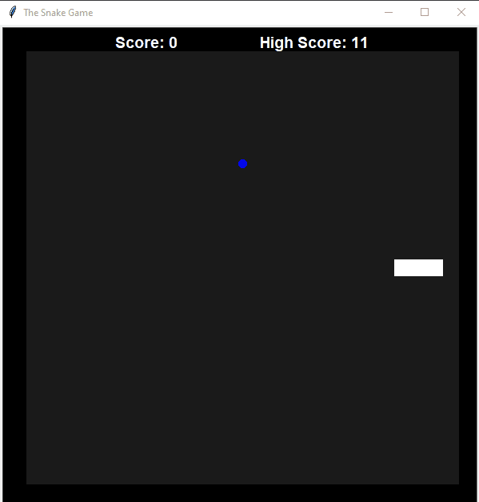
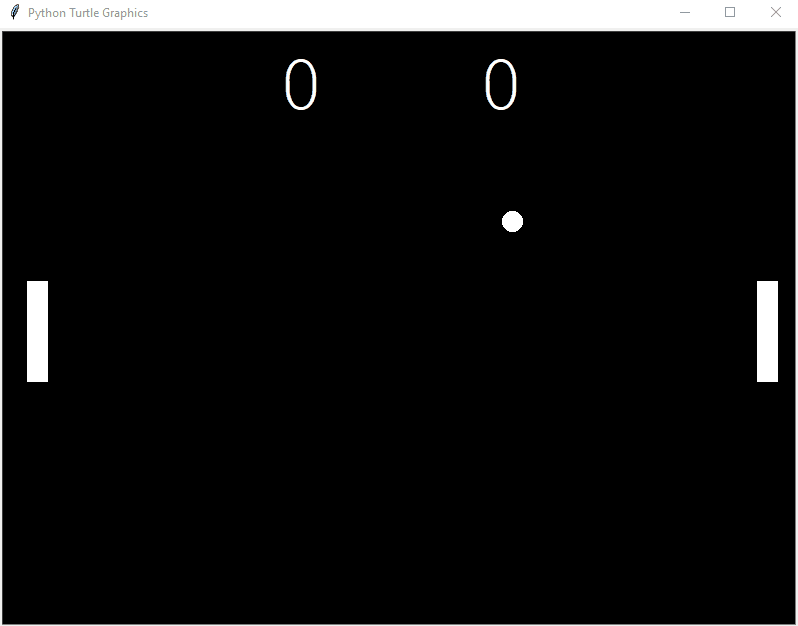
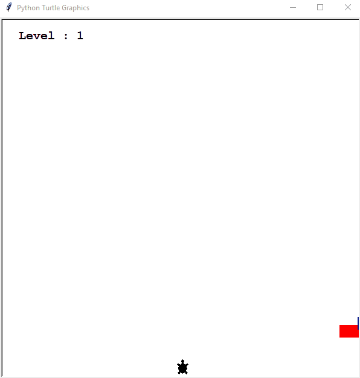
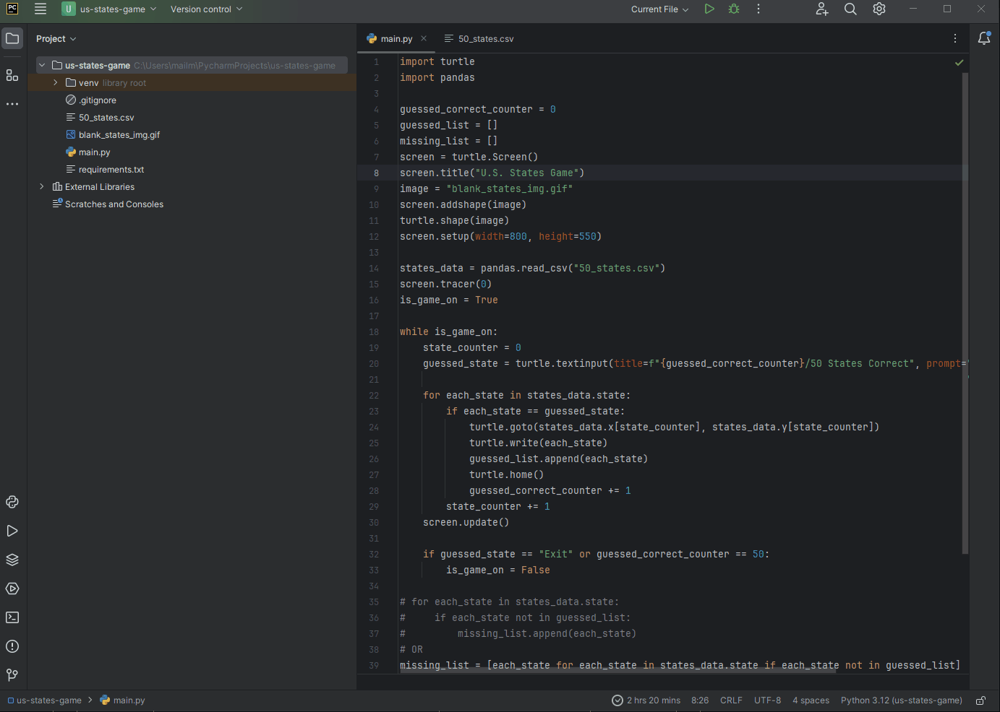
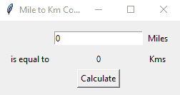
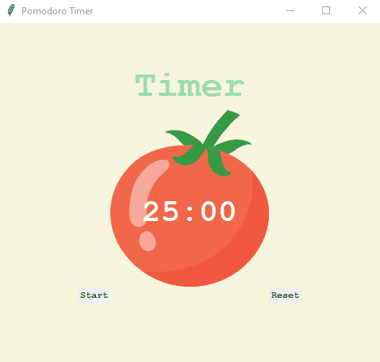
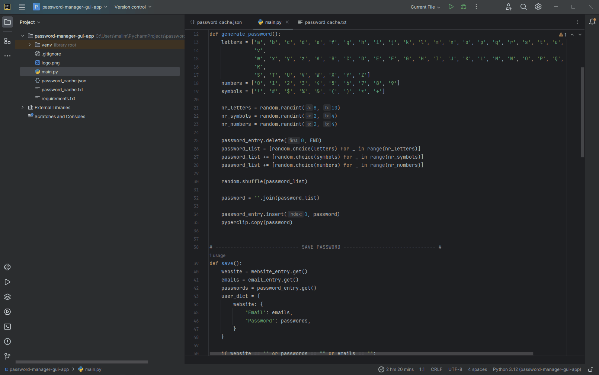
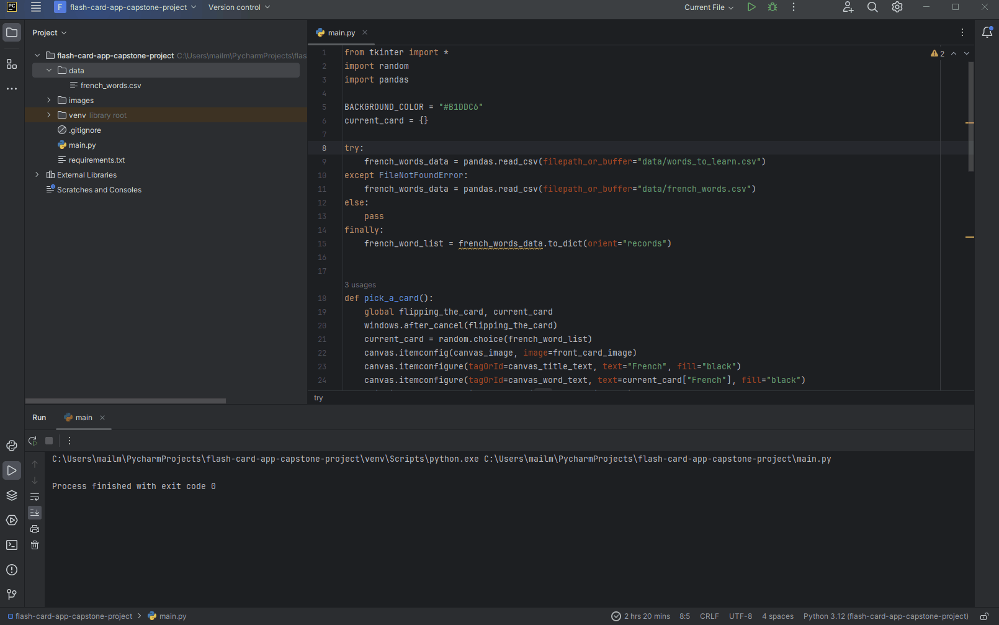

# Python GUI Projects

These python GUI projects are built in correspondence with " [100 Days of Code - The Complete Python Pro Bootcamp](https://www.udemy.com/course/100-days-of-code/) " course. This course was taught by London's App Brewery top instructor Angela Yang.<br/>

Each project has been built from scratch with minimal to no assistance.<br/>

### Day 018 - The Hirst Painting

This project generates the hirst painting using the turtle module. Extract colors from an image ('hirst_painting_2.jpg') using the colorgram module and use these colors to generate a hirst painting.

For a live version, go [here](https://replit.com/@grandeurkoe/the-hirst-painting-project?v=1) .



### Day 019 - Turtle Race

This project simulates the Turtle race game. Get the turtle (red, blue, green, yellow) the user wants to bet on as user input. Display the results of the race on the console screen.

For a live version, go [here](https://replit.com/@grandeurkoe/turtle-race?v=1) .



### Day 020 & 021 - The Snake Game

This project simulates the snake game. Food for the snake is randomly placed on the screen. Navigate the snake using the arrow keys. High scores are stored in a text file (high_score.txt).

For a live version, go [here](https://replit.com/@grandeurkoe/the-snake-game?v=1) .



### Day 022 - The Pong Game

This project simulates the pong game. Ball speed increases as the score increases. Move the first paddle up and down using the 'Up' and 'Down' arrow keys. Move the second paddle up and down using the 'w' and 's' keys. Display the score count for each player on the screen. 

For a live version, go [here](https://replit.com/@grandeurkoe/the-pong-game?v=1) .



### Day 023 - The Turtle Crossing Game

This project simulates the turtle crossing game. Speed of obstacle cars increases every level. Use the 'Up' arrow key to navigate the player car upwards. Increase level counter every time the player car reaches the other end. End game when the player car collides with the obstacle car.

For a live version, go [here](https://replit.com/@grandeurkoe/the-turtle-crossing-game?v=1) .



### Day 025 - US States Game

This project simulates the US states game. Read US states data from "50_states.csv" using the read_csv() function from the pandas library. Get the user guessed states as user input. If the guessed state exists then plot them on "blank_states_img.gif" using the x and y coordinates you previously fetched from the CSV file. Generate a CSV file with all the states that the user couldn't guess correctly when the user enters "exit" as input in the "What's another state name?" prompt.

For a live version, go [here](https://replit.com/@grandeurkoe/us-states-game?v=1) .



### Day 027 - Miles to Kilometer Converter

This project simulates a **Miles to Kilometer Converter** GUI Desktop App. Get miles as user input. Convert miles to kilometer when the user clicks on the button with label "Calculate".

For a live version, go [here](https://replit.com/@grandeurkoe/miles-to-km-converter-project?v=1) .



### Day 028 - The Pomodoro App

This project simulates the Pomodoro App. Start Pomodoro timer when user presses the "Start" button. Set "Timer" text to "Work" for 25 minutes and then set it to "Break" for 5 minutes. Reset Pomodoro timer when user presses the "Reset button". 

For a live version, go [here](https://replit.com/@grandeurkoe/the-pomodoro-app?v=1) .



### Day 029 & 030 - Password Manager

This project simulates the **Password Manager** GUI Desktop App. Get website name, email/username and password as user input. Alternatively, you can also generate a random password by clicking on the "Generate Password" button. Once you've filled in all the entries, click on the "Add" button to push these entries into a JSON file (password_cache.json). After filling in the Website field, you can click on the "Search" button to retrieve details of the aforementioned website from the JSON file.

For a live version, go [here](https://replit.com/@grandeurkoe/password-manager-gui-app?v=1) .



### Day 031 - Flash Card App

This project simulates the Flash Card App. Read french words from "french_words.csv" (first run) or "words_to_learn.csv" (for every run after the first one) file using the read_csv() function from the pandas library. Click on ✅ button if you know the word. Click on ❌ button if you don't know the word. If the user doesn't click on either buttons, then flip the card. When the user closes the app, generate "words_to_learn.csv" file and populate it with all the words that the user doesn't know.

For a live version, go [here](https://replit.com/@grandeurkoe/flash-card-app-capstone-project?v=1) .



## Getting Started

### Prerequisites

<b>For Windows:</b>
<br/> 

Download and Install the latest version of [Python](https://www.python.org/downloads/).<br/><br/>
Download and Install the latest version of [PyCharm Community Edition](https://www.jetbrains.com/pycharm/download/?section=windows).<br/>


<b>For Linux:</b>
<br/> 

<b>Linux</b> comes preinstalled with Python.<br/><br/>
To install the latest version of PyCharm Community Edition, run the following command:
```
sudo snap install pycharm-community --classic
```

### Installing

You can install all the required packages listed in the requirements.txt file for the project at the same time: 


<b>On Windows type:</b>
<br/> 
```
python -m pip install -r requirements.txt
```

<b>On MacOS type:</b>
<br/> 
```
pip3 install -r requirements.txt
```

## Built Using
<p>
  
  
  
  
  
  
  
</p>

## Authors

*Initial work* - [grandeurkoe](https://github.com/grandeurkoe)
